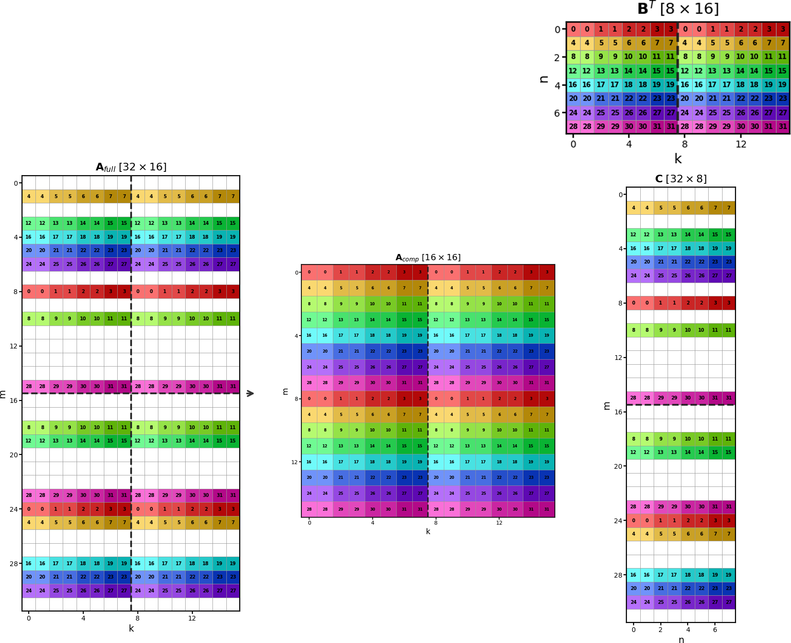

Structured Sparsity Specification Kit
=====================================

**This is a PyTorch implementation of the** :math:`S^3` **framework.**

Sparsekit provides a composable hierarchy for specifying and enforcing
structured sparsity patterns -- from 2:4 and 4:8 to coupled multi-parameter
patterns.  Pruning and masking write through directly to the
original ``nn.Parameter`` storage via ``torch.as_strided`` whenever possible to
avoid copies.

   Sparse MMA pipeline: the full A matrix (32 x 16) with coupled 1:2 row
   sparsity (rows 8 apart, one pruned per pair) is compressed to the hardware
   A fragment (16 x 16), multiplied by the dense B fragment (8 x 16), producing
   a sparse output C (32 x 8) where pruned rows remain zero.

.. toctree::
   :maxdepth: 2
   :caption: User Guide

   quickstart
   concepts
   results

.. toctree::
   :maxdepth: 2
   :caption: API Reference

   api/view
   api/block
   api/scope
   api/builder
   api/obs
   api/linalg
   api/abstracts
